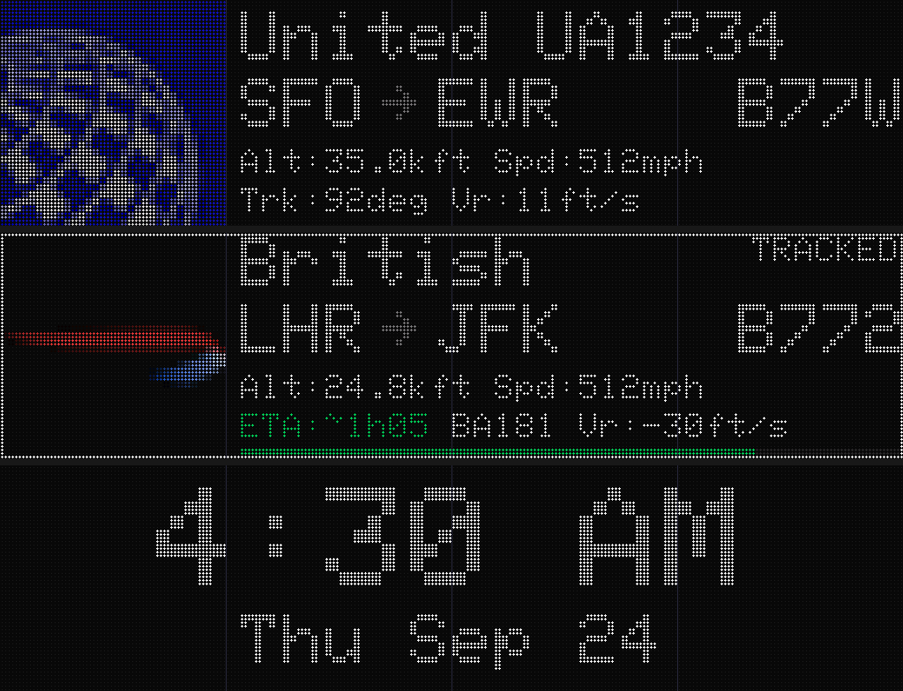

# MatrixPortal S3 + four 64×64 panels (256×64)

This fork's own build: an **Adafruit MatrixPortal S3** driving **four 64×64 HUB75
panels in one row**, a 256×64 wall. The firmware is FeatherKing's
[TheFlightWall_OSS](https://github.com/FeatherKing/TheFlightWall_OSS), which
already knew this board; what this fork adds is listed at the end.

The build env is `matrixportal_s3_4x1`, and it is the default: a bare `pio run`
builds it.



*Rendered on a PC from the real display code by `tools/panel_preview/run.sh`.
The faint lines are the joins between the four panels.*

> **Not yet run on real hardware.** The layout was checked by rendering the real
> display code on a PC (see [Preview](#preview-the-screens-without-hardware)), and the
> other panel sizes render pixel-identical to upstream. The firmware still needs its
> first build with PlatformIO, and first light on the panels.

## Parts

| | Notes |
|---|---|
| Adafruit MatrixPortal S3 | **Get the u.FL version (ADA6475) if you can**, with a small external 2.4 GHz antenna. See [WiFi](#mounting-and-wifi). The onboard-antenna version (ADA5778) works too, but mount it on a ribbon. |
| 4 × 64×64 HUB75 panels | All four the same model. They must be 1/32 scan, which is standard for 64×64. Size by pitch: P2.5 ≈ 640×160 mm, P3 ≈ 768×192 mm, P4 ≈ 1024×256 mm. |
| 5 V power supply | 10 A minimum, 20 A if you'll run it bright. See [Power](#power). |
| Power leads + capacitors | One lead per panel from the supply. Put 1000–2000 µF across each panel's power input (the HUB75 library's advice). |
| HUB75 ribbons | Three to join the panels (they ship with them). Optionally a fourth, to mount the MatrixPortal off the panel. |
| USB-C supply for the board | A phone charger is fine. Keep it separate from the panel supply. |
| *(optional)* LDR + 10 kΩ | Only if you want the light sensor at the front, facing the room. See [Auto-dim](#auto-dim). |

The HUB75 pins are fixed by the MatrixPortal's PCB, so there is nothing to wire
between the board and the first panel: it plugs into the panel's input.

## Chain order

The chain decides which end of the row is which. The panel the MatrixPortal feeds
shows the **right-most** 64 columns when you look at the front. The data shifts
through the chain, so the first pixel sent ends up at the far end.

```
BEHIND the wall, looking at the backs of the panels:

  +-----------+     +-----------+     +-----------+     +-----------+
  | IN    OUT |---->| IN    OUT |---->| IN    OUT |---->| IN    OUT |
  +-----------+     +-----------+     +-----------+     +-----------+
    ^ MatrixPortal S3 (or its ribbon) on the first panel's IN

In FRONT, what you see:

  |  x 0-63   |  x 64-127  |  x 128-191  |  x 192-255 (fed panel) |
```

- **All four panels go the same way up**: the arrows printed on the backs should all point the same way.
- **Want the board at the other end?** Mount every panel upside down, then tick **Rotate 180°** in the web UI (Advanced → HUB75 panel) and restart.
- **Troubleshooting:**
  - Text in 64-pixel chunks, in the wrong order: the chain doesn't match how the panels are placed.
  - The whole picture upside down: tick Rotate 180°.

### Address E jumper

64-row panels need the fifth address line, **E**. Adafruit sets the MatrixPortal S3's
E jumper to **HUB75 pin 8**, where most 64×64 panels carry it. If whole 16-row bands
of each panel stay dark or show the wrong rows, your panels use **pin 16**. Move the
jumper to 16: cut its default connection to 8, then solder-bridge the 16 side.

## Power

- **Power the panels straight from the 5 V supply.** Four 64×64 panels can draw
  roughly 16 A at full white; upstream's own estimate is about 8 A per 128×64.
  Flight cards at the default brightness (20/255) draw a small fraction of that. So
  size the supply for the brightest you will run it, and use thick wire for the main
  5 V run.
- **Don't feed panel power through the MatrixPortal.** Its two screw posts are wired
  straight to the USB-C 5 V line, with no diode (Adafruit's schematic). That path is
  meant for one small panel on USB power. If you do run the board from the panel
  supply through those posts, never plug USB into a computer at the same time: the
  supply would push current into the computer's port.
- **Power the board from its own USB-C supply.** The ground is shared through the
  HUB75 connector's GND pins.
- Upstream's notes (`HANDOFF.md`) record an evening lost to a board browning out on a
  shared, sagging rail. A clean supply for the board is cheap insurance.

## Mounting and WiFi

Upstream measured the MatrixPortal S3's WiFi signal dropping **~20 dB** (−55 to
−75…−80 dBm) the moment it was plugged straight onto a panel. Fetches then failed.
The board's PCB antenna ends up flat against the panel's copper ground plane.

- **Mount the board on a ribbon**, away from the panel. It has a 2×8 IDC plug for
  exactly this.
- **Or buy the u.FL version** and put its antenna clear of the panels. Both together
  is best.
- The HUB75 clock defaults to **20 MHz**, which upstream measured as kinder to WiFi
  than 8 MHz. Faster edges are less forgiving of long ribbons, though. If you see
  ghosting or pixels shifted by one:
  1. Use a shorter ribbon.
  2. Then try Advanced → HUB75 panel → Signal tuning in the web UI.

## Build and flash

You need [PlatformIO](https://platformio.org/): the VS Code extension, or
`pip install platformio`.

```bash
cd firmware
pio run -t upload       # firmware  (env matrixportal_s3_4x1, the default)
pio run -t uploadfs     # web UI + airline logos -- ERASES saved settings
```

- **No serial port?** Hold **BOOT**, tap **RESET**, release BOOT, then upload again.
- **Serial logs:** use `pio device monitor` (as the README does) or
  `tools/read_serial.py`. The board talks over TinyUSB, which stays silent until the
  host raises DTR, so a bare `cat` of the port shows nothing.
- **Check the boot log for** `[hub75] 256x64 (4 x 64x64), refresh ~116 Hz`.
- **Optional:** to skip the setup hotspot, bake your WiFi into
  `firmware/config/Secrets.h`. It is gitignored; see `Secrets.h.example`.

## First-time setup

1. Join the **`FlightWall-Setup`** WiFi. The setup page opens (or go to
   `http://192.168.4.1`). Pick your network, save, and restart.
2. Open **`http://flightwall.local/`**, or the IP shown on the wall.
3. **Setup → API keys**: enter your OpenSky client id and secret. They're free: make an
   account at [opensky-network.org](https://opensky-network.org/), then add an API
   client on your account page. Enrichment stays on **adsbdb**, which is free and
   needs no key.
4. **Tracking → Area**: set your location and radius. Auto-detect gives an
   IP-based guess, so check it.
5. **Advanced → HUB75 panel** should already read 64 × 64 × 4. On a board that
   saved another size before, press **256×64 (4×1)**, then Save and Restart.
6. **Tracking → Filters**: the airline ignore list is there, e.g. for business-jet operators.

## Auto-dim

The MatrixPortal S3 has its **own light sensor**: an ALS-PT19 on GPIO 5. Upstream
didn't use it. This fork selects it by default but leaves it **off**. The sensor is
always present, so it would act on the first boot, and an uncalibrated threshold
could blank the wall.

1. Advanced → Light sensor: type **Analog**, pin **5**, tick **Enabled**, then Save.
2. Watch the **Live reading** with the room lit, then dark. You can also type
   `light watch` on the serial console.
   - Set **Dark threshold** just above the dark reading.
   - Set **Hysteresis** so the lit reading clears threshold + hysteresis.
3. Tick **Dim instead of fully off** if you want a dim wall at night rather than a
   blank one. A blank wall also pauses fetching.

On the back of the wall, the onboard sensor sees the room second-hand. For one
that faces the room, wire an LDR to the **A2** pad (GPIO 9), then select pin 9:
3V3 → LDR → A2 → 10 kΩ → GND. The web UI lists the usable pins. The other pads
don't work here:

- A0 and A4 are on ADC2, which WiFi blocks.
- A1 is a strapping pin.
- A3 is the external-button input.

## Preview the screens without hardware

```bash
tools/panel_preview/run.sh        # 256x64 -> tools/panel_preview/out/*.png, sheet.png
tools/panel_preview/run.sh 2      # the same screens at 128x64
```

This compiles the real `firmware/adapters/Hub75Display.cpp` on your computer, so
it doubles as a compile check of that file. It then renders every screen: flight
cards, tracked card, clock, fun fact and splash. It needs g++ and Python with
Pillow. Use it to tune the layout before flashing.

## What this fork changes

Compared with FeatherKing/TheFlightWall_OSS:

- **`matrixportal_s3_4x1` env** (the default). A fresh board comes up at 256×64.
  The env also asks the HUB75 library for at least **90 Hz**: at 256 columns and
  20 MHz, the library would otherwise settle at ~65 Hz. It trades one low colour
  bit for ~116 Hz. The arithmetic is in `platformio.ini`.
- **A wide flight card** for 192×64 and up:
  - a 64 px logo (a 32 px tile scales exactly 2×),
  - the airline and flight number, then the route and aircraft type, in 2× type,
  - the Mini card's two metric rows underneath.

  The clock, fun facts and boot splash scale up too. Every other panel size renders
  pixel-identical to upstream (checked with the preview tool against upstream's
  code).
- **Rotate 180°** option (Advanced → HUB75 panel).
- **Light sensor pins.** The onboard sensor is on GPIO 5; A2 takes an external LDR.
  `/api/status` now publishes the exact usable pins (`adc1Pins`), since on this
  board they aren't a range.
- **Defaults: OpenSky + adsbdb, and no server URL.** Upstream defaulted a fresh
  board to its maintainer's own FlightWall server, so the wall's location went to
  that server every cycle. To use a server, deploy your own (`server/README.md`)
  and enter its URL.
- **OTA.** `firmware/config/FirmwareSigningKey.h` is still *upstream's* public key.
  Over-the-air updates only run if you set up a server and a control token. Before
  you do, generate your own ECDSA P-256 key pair:

  ```bash
  openssl ecparam -name prime256v1 -genkey -noout -out key.pem
  openssl ec -in key.pem -pubout
  ```

  Put the public half in `FirmwareSigningKey.h`. When signing, point
  `FLIGHTWALL_SIGNING_KEY` at the private half for `tools/sign_firmware.sh`.
- `test/test_lru.cpp` now compiles with GCC: it was missing `#include <vector>`.

## Keeping up with upstream

```bash
git remote add upstream https://github.com/FeatherKing/TheFlightWall_OSS
git fetch upstream
git merge upstream/main
```

Upstream's `HANDOFF.md` is the maintainer's lab notebook. It is worth reading before
chasing a hardware fault: the radio, ribbon and power sections all apply to this
board.
